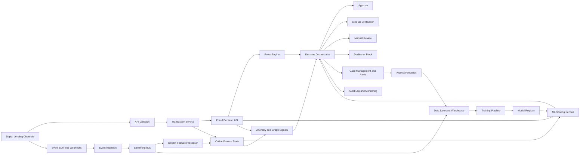

# Real-Time Fraud Detection Platform Architecture

## 1. Purpose

This document proposes an architecture for detecting and preventing fraud across digital lending journeys such as registration, login, loan application, document verification, disbursement, and repayment.

The design prioritizes:

- Fast decisions during customer-facing transactions.
- Lower false positives through risk-based, graduated actions.
- Explainable decisions for customers, operations teams, and auditors.
- Continuous learning from confirmed fraud and legitimate outcomes.
- Privacy, security, and auditable access to sensitive lending data.

## 2. Proposed High-Level Architecture



## 3. Main Components

## 3A. Prototype Architecture Mapped to the Required Layers

### 3A.1 Frontend

Build two focused views:

- **Decision simulator:** submit a lending event and see the risk score, decision, reason codes, and response time.
- **Fraud operations dashboard:** show alert volume, risk distribution, pending cases, transaction history, linked entities, and analyst actions.

The frontend should never calculate the fraud score. It calls backend APIs and renders the returned decision and explanation, keeping business logic centralized.

Suggested prototype choices are React with TypeScript, a responsive component library, and charts for operational metrics. Keep the UI modular with components for transaction input, risk summary, reason codes, case tables, and metric panels.

### 3A.2 Backend

Use a modular, API-first backend with these modules:

- `event-ingestion`: validates and stores behavioral and lending events.
- `feature-service`: calculates real-time and historical features.
- `fraud-scoring`: invokes rules and model layers.
- `decision-service`: applies thresholds and returns the final action.
- `case-service`: creates and updates analyst review cases.
- `feedback-service`: records confirmed fraud and legitimate outcomes.

FastAPI, Flask, Node.js, or Spring Boot are suitable prototype choices. The backend should expose OpenAPI documentation and use request/response schemas.

### 3A.3 Database

Use PostgreSQL for applications, events, decisions, cases, reason codes, feedback, and audit records. Use Redis for short-lived counters and online feature values. A production deployment can add object storage or a warehouse for historical training data.

Minimum entities are `customers`, `applications`, `events`, `decisions`, `features`, `fraud_cases`, `feedback_labels`, and `model_versions`. Store references to sensitive documents rather than raw documents in the scoring database.

### 3A.4 AI Layer

The AI layer contains the supervised model, anomaly detector, graph features, explanation generator, and model monitoring. The first prototype should use a trained LightGBM or XGBoost model with a deterministic fallback when model features are unavailable. See `model_info.md` for the feature catalog.

AI outputs are decision evidence. The final action is produced by a versioned policy combining model risk, hard rules, confidence, transaction value, and verification options.

### 3A.5 Cloud Layer

The prototype may run locally with Docker Compose and be deployable to the cloud without changing its interfaces:

| Capability | Azure example | Portable local equivalent |
|---|---|---|
| Web/API hosting | Azure Container Apps or App Service | Docker Compose |
| Database | Azure Database for PostgreSQL | PostgreSQL container |
| Cache | Azure Cache for Redis | Redis container |
| Event streaming | Azure Event Hubs or Service Bus | Kafka, Redpanda, or an in-process queue |
| Training data | Azure Blob Storage | Local storage volume |
| Secrets | Azure Key Vault | Environment variables in `.env` |
| Monitoring | Azure Monitor and Application Insights | Structured logs and metrics |

Provider-specific adapters should be isolated behind interfaces.

### 3A.6 Security Layer

- Use OAuth2/JWT or equivalent API authentication.
- Enforce role-based authorization for analysts, administrators, and services.
- Validate requests and apply rate and payload-size limits.
- Keep credentials in environment variables or a secret manager, never in Git.
- Hash or tokenize identifiers when raw values are unnecessary.
- Encrypt network traffic and database backups.
- Record security-relevant access and decision events without logging secrets.
- Add dependency scanning and static analysis to CI.

## 3B. API-First Contract

The initial backend should expose at least these endpoints:

| Method | Endpoint | Purpose |
|---|---|---|
| `POST` | `/api/v1/events` | Ingest a customer, device, application, or payment event |
| `POST` | `/api/v1/fraud/score` | Score a transaction and return the recommended action |
| `GET` | `/api/v1/decisions/{decision_id}` | Retrieve an auditable decision |
| `GET` | `/api/v1/cases` | List review cases with filters and pagination |
| `PATCH` | `/api/v1/cases/{case_id}` | Record analyst status and outcome |
| `GET` | `/api/v1/metrics` | Return dashboard metrics |
| `GET` | `/health` | Report service health |

Mutating requests should accept an idempotency key where retries could create duplicate events or cases. Error responses should include an error code, safe message, correlation ID, and validation details.

## 3C. Suggested Repository Structure

```text
frontend/
backend/
  app/
    api/
    domain/
    features/
    models/
    services/
  tests/
ml/
  data/
  training/
  evaluation/
infra/
docs/
README.md
.env.example
docker-compose.yml
```

Keep frontend, backend, model, infrastructure, and documentation responsibilities separate. Keep generated datasets, secrets, and customer data out of source control.

## 3D. Engineering and Delivery Checklist

- Use meaningful names, small modules, and explicit interfaces.
- Add a README with architecture, prerequisites, setup, environment variables, run commands, API examples, and demo credentials if needed.
- Provide `.env.example`; never commit `.env`, API keys, certificates, or customer data.
- Add unit tests for feature calculations, rules, score combination, threshold decisions, and API validation.
- Add integration tests for database persistence and the score endpoint.
- Add an end-to-end smoke test covering submit application -> score -> create case -> analyst feedback.
- Format and lint frontend, backend, and model code in CI.
- Use synthetic or anonymized data in the prototype.
- Version API contracts, model artifacts, feature definitions, and decision policies.
- Include architecture and data-flow diagrams in the final presentation.

## 3E. PPT or PDF Storyline

1. Problem, fraud impact, and limitations of static rules.
2. Target users and representative fraud scenarios.
3. Proposed solution and end-to-end architecture diagram.
4. Frontend, backend, database, AI, cloud, and security layers.
5. Model features, model selection, risk thresholds, and explainability.
6. Demo of approve, step-up, and manual-review outcomes.
7. API and repository design plus testing evidence.
8. Responsible AI, privacy, security, and operational safeguards.
9. Results, limitations, and next steps toward production.

### 3.1 Lending channels and event collection

Capture application, authentication, device, identity, payment, and repayment events from web, mobile, partner, and call-center channels. Every event should include a unique event ID, event type, timestamp, customer or application reference, channel, and correlation ID.

Examples:

- `application_started`, `application_submitted`
- `login_success`, `login_failure`, `password_reset`
- `document_uploaded`, `identity_verified`
- `device_seen`, `ip_seen`, `payment_method_added`
- `loan_approved`, `loan_disbursed`, `repayment_failed`
- `fraud_confirmed`, `case_closed`

### 3.2 API gateway and fraud decision API

The API gateway authenticates callers, applies rate limits, validates schemas, and propagates correlation IDs. The fraud decision API receives a transaction context and returns a decision, risk score, reason codes, model version, and expiry time.

Illustrative response:

```json
{
  "decision": "STEP_UP",
  "risk_score": 0.78,
  "reason_codes": ["NEW_DEVICE", "HIGH_VELOCITY", "IDENTITY_MISMATCH"],
  "model_version": "fraud-risk-2026-09-01",
  "decision_id": "decision-123",
  "expires_at": "2026-09-21T12:00:00Z"
}
```

### 3.3 Streaming ingestion and event bus

Use a durable event bus such as Kafka, Azure Event Hubs, or a comparable managed service. Partition by customer, device, or application reference when ordering is important. Consumers should be idempotent because events may be delivered more than once.

The event bus supports:

- Near-real-time feature updates.
- Alert generation and case creation.
- Historical storage for training and investigations.
- Replay of events when feature logic changes.

### 3.4 Feature platform

Maintain the same feature definitions for offline training and online inference. Store short-lived, low-latency features in an online feature store and historical feature values in a warehouse or data lake.

Feature examples include application velocity, device reuse, IP concentration, identity consistency, behavioral deviation, and repayment history. See `model_info.md` for the feature catalog.

### 3.5 Decision engine

The decision engine combines deterministic controls and model outputs in this order:

1. Reject impossible or explicitly prohibited requests.
2. Apply mandatory regulatory, sanctions, and policy controls.
3. Request the latest features and score the transaction.
4. Combine supervised risk, anomaly risk, graph risk, and business context.
5. Select a graduated action using calibrated thresholds.
6. Return reason codes and write an immutable audit record.

Suggested actions are `APPROVE`, `STEP_UP`, `MANUAL_REVIEW`, and `DECLINE`. A risk score should not automatically equal a decline; the action should also consider loan amount, customer segment, model confidence, and available verification methods.

### 3.6 Case management and analyst feedback

Create a case for manual review or high-confidence alerts. Analysts should see the transaction timeline, linked entities, contributing features, reason codes, prior cases, and recommended action. Their outcome becomes a labeled event such as confirmed fraud, legitimate activity, or inconclusive.

### 3.7 Data, training, and model registry

Use a governed data lake or warehouse for raw events, curated features, labels, case outcomes, and model evaluation data. Training pipelines must version datasets, feature definitions, code, thresholds, and model artifacts. A model registry should support approval, rollback, champion/challenger evaluation, and deployment metadata.

## 4. End-to-End Decision Flow

1. A customer submits an application or performs a sensitive lending action.
2. The channel sends the transaction context to the fraud decision API.
3. The service retrieves online features and computes request-specific features.
4. Rules, supervised ML, anomaly detection, and graph signals produce risk evidence.
5. The decision orchestrator calibrates the combined risk and selects an action.
6. The lending workflow receives the decision within the latency budget.
7. The platform records the decision, inputs, explanations, and model version.
8. Later outcomes and analyst decisions update labels for monitoring and retraining.

## 5. Reliability and Performance Targets

For an MVP, use these targets as engineering hypotheses and validate them with load testing:

- Synchronous fraud decision p95 latency: less than 300 ms.
- Decision API availability: at least 99.9%.
- Duplicate events: safe to process without duplicate cases or feature inflation.
- Event-to-feature freshness: less than 10 seconds for streaming features.
- Fail-closed only for clearly critical controls; otherwise use a documented fallback action such as `MANUAL_REVIEW`.

## 6. Security and Privacy

- Encrypt data in transit and at rest.
- Tokenize or hash sensitive identifiers where raw values are unnecessary.
- Apply least-privilege access and separate analyst, engineering, and service roles.
- Avoid storing raw identity documents in the scoring path.
- Log access to sensitive data and retain audit records according to policy.
- Enforce retention and deletion policies for customer and behavioral data.
- Protect the scoring API with authentication, authorization, rate limits, and request validation.

## 7. Observability

Monitor both system and fraud outcomes:

- API latency, errors, timeouts, throughput, and feature-store misses.
- Approval, step-up, review, and decline rates by channel and segment.
- Fraud capture rate, false-positive rate, prevented loss, and review backlog.
- Feature missingness, drift, distribution changes, and data freshness.
- Model score distribution, calibration, precision, recall, and population stability.
- Changes in fraud patterns, attack bursts, device clusters, and impossible travel.

Every decision should be traceable using a decision ID, correlation ID, model version, rule version, feature snapshot reference, and final outcome.

## 8. MVP Scope

The first demonstrable version can use:

- A REST decision API.
- A small event store and online feature cache.
- A rules engine with configurable thresholds.
- A gradient-boosted tree fraud model plus an isolation-based anomaly model.
- A simple analyst queue with feedback labels.
- A dashboard showing decisions, scores, reason codes, and key metrics.

Production hardening can later add graph databases, streaming infrastructure at scale, model serving autoscaling, advanced identity verification, and automated champion/challenger deployment.
